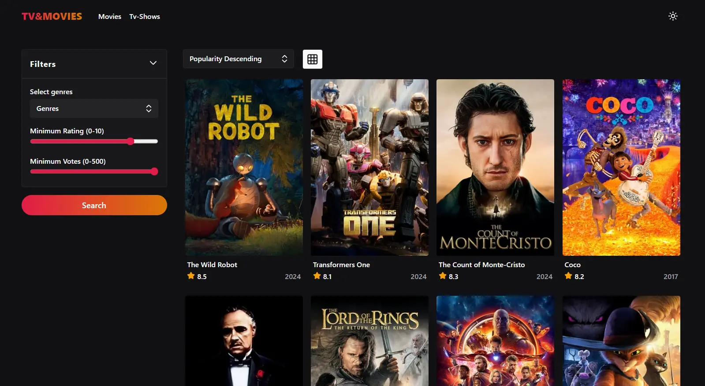

# 🎬 Movie & TV Show Explorer

## 🚀 About the Project

This project is a dynamic web application built with React that allows users to explore a vast collection of movies and TV shows. Leveraging the TMDb (The Movie Database) API, the application provides users with detailed information about movies, TV shows, actors, and more.

## ✨ Key Features

- **Infinite Scrolling**: Smoothly browse through an endless list of movies and TV shows.
- **Detail View Toggle**: Easily switch between a detailed single-column view with comprehensive information and a multi-column grid view for quicker browsing.
- **Advanced Filtering**: Customize your search with various filtering options.
- **Search Functionality**: Quickly find movies, TV shows, and actors using the search box.
- **Detailed Information**: Get comprehensive details about your favorite movies, TV shows, and actors.

## 🛠️ Tech Stack

- **Vite**
- **React**
- **TypeScript**
- **Tanstack React Query**
- **Tailwind CSS**
- **Headless UI**

## API Key

I am aware that the Tmdb API key is exposed since this a full client side application. This is just a pet project to create a nice UI and work with a 3rd part API.
